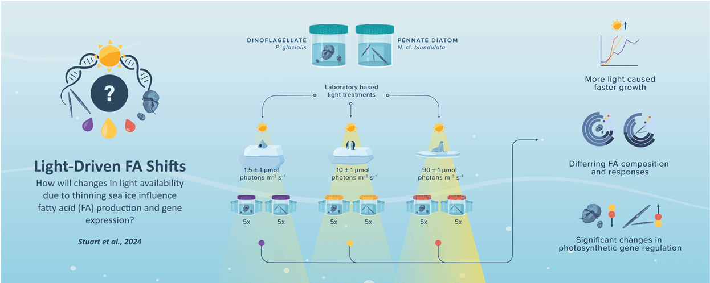
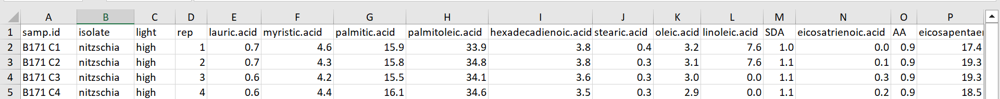
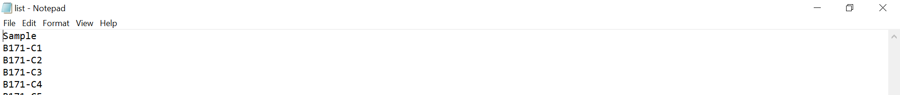
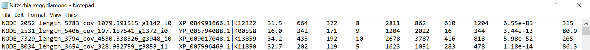
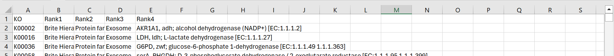
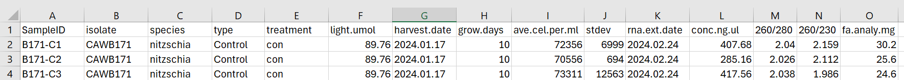

# Light-Dependent Variations in Fatty Acid Profiles and Gene Expression in Antarctic Microalgal Cultures

### Contents
[Overview](#overview)   |   [Abstract](#abstract)   |   [Script Files](#script-files)   |   [Metadata Examples](#metadata-examples)   |   [R Requirements](#r-requirements)
  
## Overview
This repository contains R scripts used to process and analyze fatty acid (FA) percentage data and transcriptomic data for the study:

**Title:** Light-Dependent Variations in Fatty Acid Profiles and Gene Expression in Antarctic Microalgal Cultures  
**Authors:** Jacqui Stuart1, 2, Kirsty F. Smith2, Matt Miller2, John K. Pearman2, Natalie Robinson3, Lesley Rhodes2, Lucy Thompson2, Sarah Challenger2, Nicole Parnell4, Ken G. Ryan1  
**Affiliations:**  
1. [School of Biological Sciences, Victoria University of Wellington](https://www.victoria.ac.nz/sbs), Wellington, New Zealand  
2. [Cawthron Institute](https://www.cawthron.org.nz), Nelson, New Zealand  
3. [National Institute of Water and Atmospheric Research (NIWA)](https://www.niwa.co.nz), Wellington, New Zealand  
4. [Lincoln University](https://www.lincoln.ac.nz), Lincoln, New Zealand

## Abstract
Photosynthetic eukaryotic microalgae are key primary producers in the sea ice environment. Anticipated changes in sea ice thickness and snow load due to climate change may cause substantial shifts in available light to these ice-associated organisms. This study used a laboratory-based experiment to investigate how light levels, simulating different sea ice thicknesses, affect FA composition in two ice-associated microalgae species: *Nitzschia cf. biundulata* and *Polarella glacialis*. Transcriptomic analyses and fatty acid profiling were used to assess the impact of three light levels:  
- **High light (90 ± 1 μmol photons m⁻² s⁻¹)**: simulating conditions at the bottom of very thin ice  
- **Mid light (10 ± 1 μmol photons m⁻² s⁻¹)**: simulating conditions at the bottom of thin ice  
- **Low light (1.5 ± 1 μmol photons m⁻² s⁻¹)**: simulating conditions at the bottom of thick ice  

The study revealed changes in growth rates and FA composition under different light conditions. *N. cf. biundulata* exhibited significant changes in specific saturated and monounsaturated FAs, with an increase in energy storage-related FAs under conditions mimicking thinner ice. *Polarella glacialis* showed significant changes in polyunsaturated fatty acids (PUFAs), particularly octadecapentaenoic acid (OPA), indicating enhanced membrane fluidity and synthesis of longer-chain PUFAs. Light levels emulating thinning sea ice conditions resulted in down-regulation of photosynthetic genes in *N. cf. biundulata* and up-regulation in *P. glacialis*, indicating diverse acclimation strategies. These findings provide insights into microalgal responses to light stress and potential implications for polar food webs under climate change scenarios.

## Script files
- **scripts/**: R scripts used to process and analyze fatty acid and transcriptomic data.
    - `PhD_Ch6_FattyAcidAnalysis`: Analysis and visualization of fatty acid profiles.
    - `PhD_Ch6_TranscriptomicsAnalysis`: Preprocessing and analysis of transcriptomic data.

## Metadata examples
Below are examples of the .csv data layouts required for each analysis script:

### Fatty Acid (FA) Analysis Metadata
For FA analysis you need a `.csv` file, which includes the FA percent data and relevant metadata (see below)

### Transcriptomics Analysis Metadata
A few more files are required for this analysis, these include:

**1. Salmon Quantification Files**
   - File Type: quant.sf
   - Description: These files contain transcript-level abundance estimates generated by the Salmon software. They are expected to be located in subdirectories named after each sample within the `salmon_quant` directory. Each `quant.sf` file corresponds to a sample listed in `list.txt`.

**2. Sample Information File**
   - File Type: list.txt
   - Description: A text file containing metadata about the samples. It should include a header row and be formatted in a way that allows the read.table() function to properly read the sample names into a data frame.

   

**3. KEGG Taxonomy Data File**

   - File Type: Nitzschia_keggdiamond.txt
   - Description: A text file containing KEGG taxonomy data. This file is read using read.csv(). The code expects that this file does not have a header row (indicated by header = FALSE).

**4. KEGG Pathway Data File**
   - File Type: ko.kegg.csv
   - Description: A CSV file containing KEGG pathway information.

**5. Metadata File**
   - File Type: Metadata.csv
   - Description: A CSV file containing metadata about the samples, including the SampleID column used to set row names in the metadata data frame.

## R Requirements
To run the scripts in this repository, you will need:
- **R version >= 4.0**
- **R packages for fatty acid analysis:** `dplyr`, `ggpubr`, `patchwork`, `stringr`, `gridExtra`, `tidyr`
- **R packages for transcriptomic analysis:** `tximport`, `tidyverse`, `DESeq2`, `phyloseq`, `vegan`
